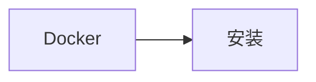

<!--more-->

# 1.安装Docker

```bash
yum list docker-ce --showduplicates | sort -r                 //查看可用的版本

yum install docker-ce-版本号                                   //选择一个版本进行安装

systemctl start docker & systemctl enable docker               //设置开机自启动

docker version                                                //查看有无安装成功
```

```bash
sudo vim /etc/docker/daemon.json                         //修改配置文件
```

```
//修改阿里云镜像
{
    "registry-mirrors": ["https://2l5j7ihl.mirror.aliyuncs.com"]   //地址可以去阿里云申请
}
```

```bash
sudo systemctl daemon-reload            //重新加载配置文件
sudo systemctl restart docker           //重启docker
```

