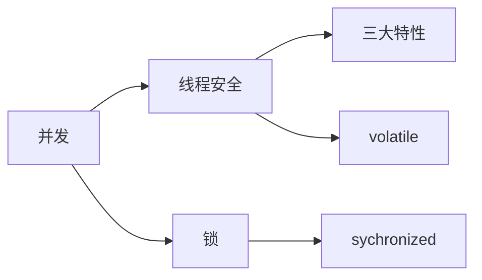

<!--more-->

# 1.线程安全

## 1.1概念

**在拥有共享数据的多条线程并行执行的程序中，线程 安全的代码会通过同步机制保证各个线程都可以正常 且正确的执行，不会出现数据污染等意外情况。**

## 1.2 线程安全三大特性

- 原子性 ：即一个操作或者多个操作 要么全部执行并且执行的过程不会被任何 因素打断，要么就都不执行。i = i + 1。
- 可见性 ： 当多个线程访问同一个变量时，一个线程修改了这个变量的值，其 他线程能够立即看得到修改的值。 
- 有序性 ： 如果在本线程内观察，所有的操作都是有序的；如果在一个线程观 察另一个线程，所有的操作都是无序的。

## 1.3 volatile关键字

**可见性：**对于加了volatile关键字的成员变量，在对这个变量进⾏修改时，会直接将**CPU⾼级缓存中的数据写回到主内存**，对这个变量的读取也会直接从主内存中读取，从⽽保证了可⻅性 ，也就是当㇐个线程修改了㇐个被 volatile修饰共享变量的值，新值总是可以被其他线程⽴即得知。

**有序性 ：**底层是通过操作系统的内存屏障来实现的，由于使⽤了内存屏障，所以会禁⽌指令重排，所以同时也就保证 了有序性，在很多并发场景下，如果⽤好volatile关键字可以很好的提⾼执⾏效率。

**(X)原子性**：volatile**无法保证原子性** 对任意单个volatile变量的读/写具有原子性，但类似于volatile++这种复合操作不具 有原子性。

# 2.锁

## 2.1 sychronized(同步锁)

偏向锁：在锁对象的对象头中记录㇐下当前获取到该锁的线程ID，该线程下次如果⼜来获取该锁就可以直接 获取到了 

轻量级锁：由偏向锁升级⽽来，当㇐个线程获取到锁后，此时这把锁是偏向锁，此时如果有第⼆个线程来竞 争锁，偏向锁就会升级为轻量级锁，之所以叫轻量级锁，是为了和重量级锁区分开来，轻量级锁底层是通过 ⾃旋来实现的，并不会阻塞线程 

如果⾃旋次数过多仍然没有获取到锁，则会升级为重量级锁，重量级锁会导致线程阻塞 

⾃旋锁：⾃旋锁就是线程在获取锁的过程中，不会去阻塞线程，也就⽆所谓唤醒线程，阻塞和唤醒这两个步 骤都是需要操作系统去进⾏的，⽐较消耗时间，⾃旋锁是线程通过CAS获取预期的㇐个标记，如果没有获取 到，则继续循环获取，如果获取到了则表示获取到了锁，这个过程线程㇐直在运⾏中，相对⽽⾔没有使⽤太 多的操作系统资源，⽐较轻量。

**锁升级**

# 3.多线程

## 3.1 Java中创建线程的三种方式

- 继承Thread类创建线程 
- 实现Runnable接口创建线程 
- 使用Callable和Future创建线程

|          | 继承Thread类                 | 实现Runnable接口                       | 利用线程池                     |
| -------- | ---------------------------- | -------------------------------------- | ------------------------------ |
| 优点     | 编程简单执行效率高           | 面向接口编程，执行效率高               | 容器管理线程，允许返回值与异常 |
| 缺点     | 单继承，无法对线程组有效控制 | 无法对线程组有效控制，没有返回值，异常 | 执行效率相对低，编程麻烦       |
| 使用场景 | 不推荐使用                   | 简单的多线程程序                       | 企业级应用，推荐使用           |

# 4.JVM内存模型
