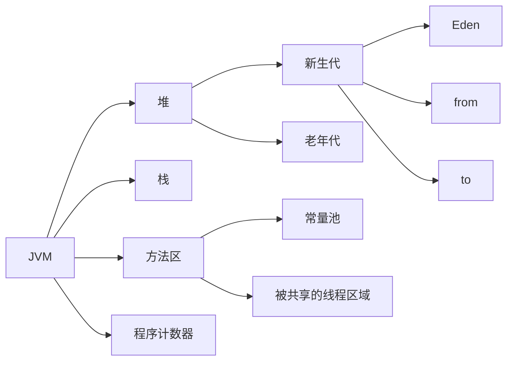

<!--more-->

## 1.JVM中存储类型

**堆**：存储的是对象本身

**栈**：（1）存储对象的引用 （2）存储基本数据类型  （3） 方法调用时进栈，方法执行完退栈

**方法区：** （1）常量池、静态区

```Java
 1 String s1 = "Hello";
 2 String s2 = "Hello";
 3 String s3 = "Hel" + "lo";
 4 String s4 = "Hel" + new String("lo");
 5 String s5 = new String("Hello");
 6 String s6 = s5.intern();
 7 String s7 = "H";
 8 String s8 = "ello";
 9 String s9 = s7 + s8;
10           
11 System.out.println(s1 == s2);  // true
12 System.out.println(s1 == s3);  // true
13 System.out.println(s1 == s4);  // false
14 System.out.println(s1 == s9);  // false
15 System.out.println(s4 == s5);  // false
16 System.out.println(s1 == s6);  // true
```

