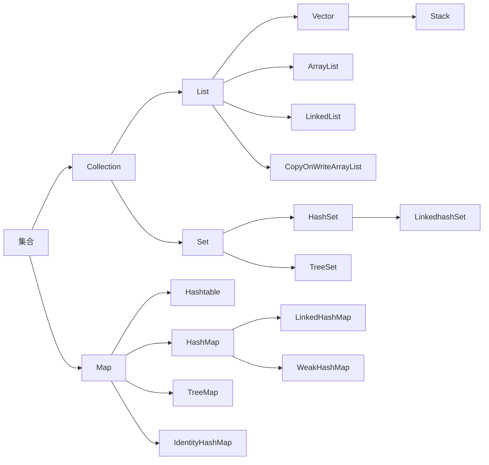

<!--more-->

# 2.List接口

## 2.1 List的第一代集合类 

##### Vector：

- 第一代集合类，线程安全，类似于是把ArrayList的所有public方法都加上synchronized锁

## 2.2 List的第二代集合类

##### ArrayList:

- 数据结构：底层使用数组实现，地址是连续的内存
- 特点：查询快，增删慢
- 线程不安全
- 重要参数：初始大小无参是0，调用add方法后是10，加载因子是1，默认扩容1.5

##### LinkedList:

- 数据结构：底层是链表结构，地址是不连续的
- 特点：查询慢，增删快
- 线程不安全

## 2.3 List的第三代集合类

##### CopyOnWriteArrayList:

- 是什么：CopyOnWrite容器即写时复制的容器。通俗的理解是**当我们往一个容器添加元素的时候，不直接往当前容器添加，而是先将当前容器进行Copy，复制出一个新的容器，然后新的容器里添加元素，添加完元素之后，再将原容器的引用指向新的容器。**
- 好处：我们可以对CopyOnWrite容器进行并发的读，而不需要加锁，因为当前容器不会添加任何元素。所以CopyOnWrite容器也是一种读写分离的思想，读和写不同的容器
- 应用场景：读多写少
- 实现原理：**CopyOnWrite+Lock锁**
- 线程安全：CopyOnWrite容器只能保证数据的最终一致性，不能保证数据的实时一致性。

## 2.4 八股文

- ##### 问：ArrayList和Vector有何区别

  答：

  1.ArrayList有三个构造方法

  ```java
  public ArrayList(int initialCapacity)//构造一个具有指定初始容量的空列表。    
  public ArrayList()      //默认构造一个初始容量为10的空列表。    
  public ArrayList(Collection<? extends E> c)//构造一个包含指定 collection 的元素的列表
  ```

  Vector有四个构造方法

  ```Java
  public Vector()//使用指定的初始容量和等于0的容量增量构造一个空向量。    
  public Vector(int initialCapacity)//构造一个空向量，使其内部数据数组的大小，其标准容量增量为零。    
  public Vector(Collection<? extends E> c)//构造一个包含指定 collection 中的元素的向量    
  public Vector(int initialCapacity,int capacityIncrement)//使用指定的初始容量和容量增量构造一个空的向量    
  ```

  2.Vector是线程安全的，线程安全的意思是多个线程访问同一代码，不会产生不确定性结果。而ArrayList不是。

  3.执行效率，ArrayList的执行效率高于Vector，因为Vector在public方法上都加了Synchonized锁，所以执行效率会比较低。

  4.Vector可以设置增长因子，而ArrayList的增长因子是固定的。

- ##### 问：ArrayList和LinkedList有啥区别

  答：1.底层数据结构不同：ArrayList是基于数组实现的，因为地址是连续的，一旦存储好了，查询速度是比较快的；而LinkedList是基于链表实现，这就意味着地址可以不是连续的，save和remove的效率比较高，而查询的效率相对比较低。

- ##### 问：ArrayList的扩容机制是怎么样的

  1.使用无参构造ArrayList当时的长度为0，如果后面调用add（）方法，将会给数组分配的**初始长度为10**.

  ```java
       /**
       * 要分配的最大数组大小
       */
      private static final int MAX_ARRAY_SIZE = Integer.MAX_VALUE - 8;
  
      /**
       * ArrayList扩容的核心方法。
       */
      private void grow(int minCapacity) {
          // oldCapacity为旧容量，newCapacity为新容量
          int oldCapacity = elementData.length;
          //将oldCapacity 右移一位，其效果相当于oldCapacity /2，
          //我们知道位运算的速度远远快于整除运算，整句运算式的结果就是将新容量更新为旧容量的1.5倍，
          int newCapacity = oldCapacity + (oldCapacity >> 1);
          //然后检查新容量是否大于最小需要容量，若还是小于最小需要容量，那么就把最小需要容量当作数组的新容量，
          if (newCapacity - minCapacity < 0)
              newCapacity = minCapacity;
         // 如果新容量大于 MAX_ARRAY_SIZE,进入(执行) `hugeCapacity()` 方法来比较 minCapacity 和 MAX_ARRAY_SIZE，
         //如果minCapacity大于最大容量，则新容量则为`Integer.MAX_VALUE`，否则，新容量大小则为 MAX_ARRAY_SIZE 即为 `Integer.MAX_VALUE - 8`。
          if (newCapacity - MAX_ARRAY_SIZE > 0)
              newCapacity = hugeCapacity(minCapacity);
          // minCapacity is usually close to size, so this is a win:
          elementData = Arrays.copyOf(elementData, newCapacity);
      }
  ```

  

  2.`ensurExplicitCapacity` 判断是否需要进行扩容，

  - 当我们要 add 进第 1 个元素到 ArrayList 时，elementData.length 为 0 （因为还是一个空的 list），因为执行了 `ensureCapacityInternal()` 方法 ，所以 minCapacity 此时为 10。此时，`minCapacity - elementData.length > 0`成立，所以会进入 `grow(minCapacity)` 方法。
  - 当 add 第 2 个元素时，minCapacity 为 2，此时 e lementData.length(容量)在添加第一个元素后扩容成 10 了。此时，`minCapacity - elementData.length > 0` 不成立，所以不会进入 （执行）`grow(minCapacity)` 方法。
  - 添加第 3、4···到第 10 个元素时，依然不会执行 grow 方法，数组容量都为 10。

  直到添加第 11 个元素，minCapacity(为 11)比 elementData.length（为 10）要大。进入 grow 方法进行扩容。

  3.**int newCapacity = oldCapacity + (oldCapacity >> 1),所以 ArrayList 每次扩容之后容量都会变为原来的 1.5 倍左右（oldCapacity 为偶数就是 1.5 倍，否则是 1.5 倍左右）！**  奇偶不同，比如 ：10+10/2 = 15, 33+33/2=49。如果是奇数的话会丢掉小数.

# 3.Map接口

## 3.1 Map第一代集合类

##### HashTable：

- 线程安全
- 实现原理类似HashMap把所有的public方法加同步锁synchronized

## 3.2 Map第二代集合类

##### HashMap:

- 线程不安全：
  - 单线程扩容会导致头尾颠倒
  - 多线程扩容会形成链表环
- 底层数据结构：1.7数组+Entry链表   1.8数组+链表（红黑树）
- 重要参数：初始容量，无参构造数组是16，如果是有参构造就是最接近传入参数的可以被平方根的数（2次幂数），加载因子是0.75，默认扩容到2倍

##  3.3 Map第三代集合类

