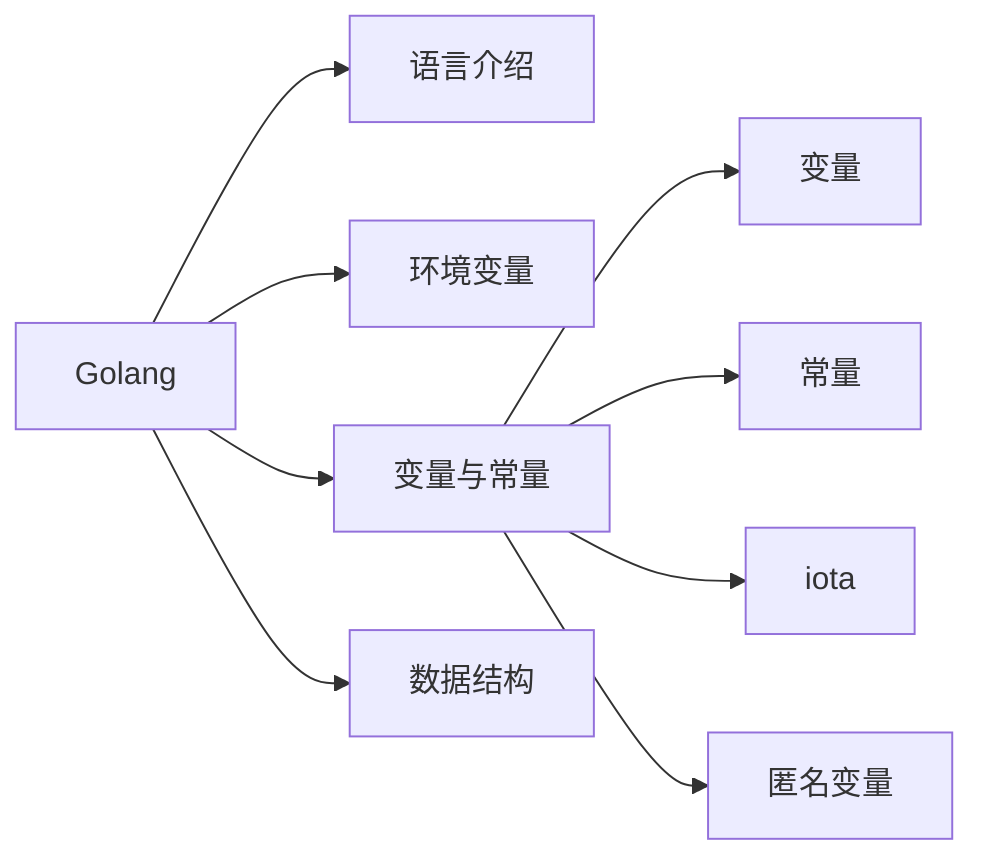
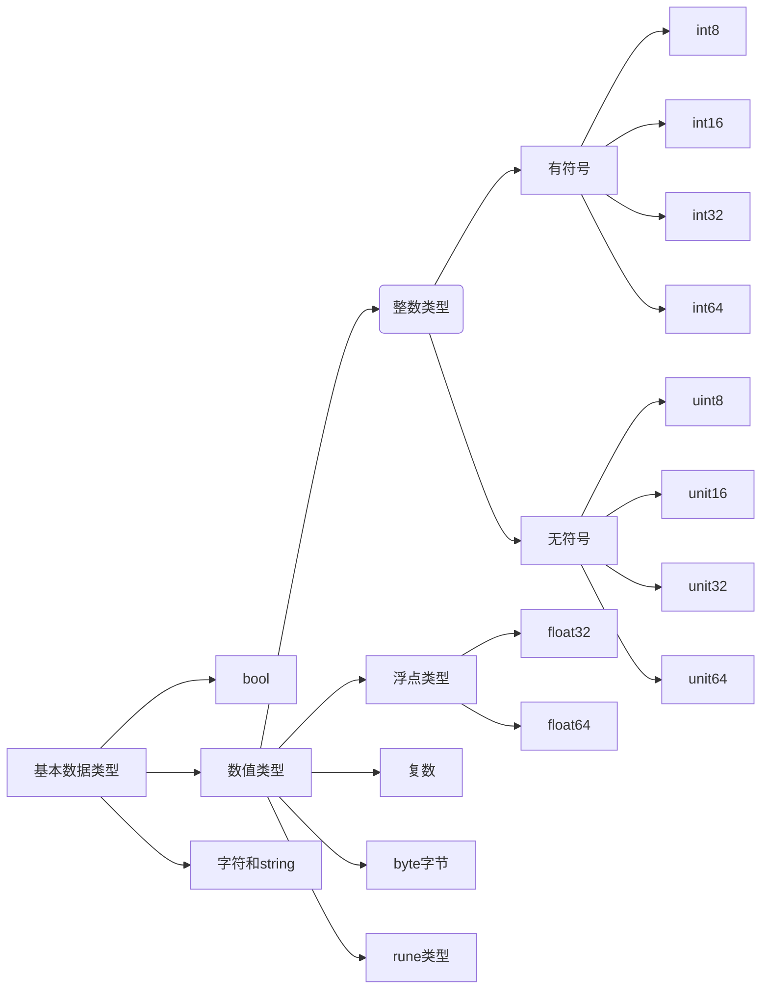

<!--more-->

# 1.Go语言介绍

golang语言是一个**编译型语言**（静态语言），2006年开始，2009年开源，国内发展十分迅速。语法简单、后发语言集各种语言的优势、

执行性能高、并发编程非常高效、编译速度快。能做什么，1.web开发 2.容器虚拟化 3.中间件 4.区块链 5.微服务

# 2.Go的环境变量

- GOROOT：Go 语言安装根目录的路径，也就是 GO 语言的安装路径。

- GOPATH：若干工作区目录的路径。是我们自己定义的工作空间。

  ```mermaid
  graph LR;
  
  源码文件-->命令源码文件
  源码文件-->库源码文件
  源码文件-->测试源码文件
  
  命令源码文件-->独立程序入口
  命令源码文件-->属于main包,包含无参数无结果的main函数
  命令源码文件-->main函数执行结果意味着当前程序运行结果
  命令源码文件-->同一代码包中不要放多个命令源码文件
  命令源码文件-->命令源码文件不要和库源码文件放在同一个代码包中
  命令源码文件-->构建
  命令源码文件-->安装
  构建-->A(构建后生成可执行文件可执行文件为executable file)
  A-->windows一般生成.exe文件
  A-->Linux一般没有扩展名
  构建-->生成位置在命令执行目录
  安装-->安装后生成可执行文件
  ```

  

- GOBIN：GO 程序生成的可执行文件（executable file）的路径。

# 3.Go语言中的变量和常量

## 3.1变量

- Go中的变量类型：
- Go中定义变量规范：
  - 变量必须先定义后使用
  - 变量必须有类型
  - 类型定下来之后不能改变
  - go语言中，局部变量定义了不使用是不可以的，编译的时候会报错，全局变量可以不使用
  - 变量名不能冲突
  - 变量是有默认值的

```go
package main

//批量定义
var(
    name = "hello"
    age = 10
    ok bool
)

func main(){
    //第一种
    var name （string）= "1"
    
    //第二种
    age:=1
    
    //多变量定义
    var user1,user2,user3 = "boby1",1,"boby3"
    

}
```

- 全局变量和局部变量

  - 全局变量和局部变量名字可以相同
  - 相同名字的全局变量和局部变量，变量类型可以不同
  - 在函数内使用时，优先级是：局部变量>全局变量
  - 简介变量定义方法不能用于全局变量

  ```go
  package main
  import "fmt"
  var name = "我是全局变量"
  
  func main() {
  	var name = 1
  	fmt.Print(name)
  }
  //输出
  //API server listening at: 127.0.0.1:57006
  //1
  //调试器 已完成，退出代码为 0
  ```

## 3.2常量的定义

常量是定义的时候就指定的值，不能修改。加const关键字就可以了

- 常量要全部大写，如果是不同的单词，中间要加下划线
- 常量类型只可以定义bool、数值（整数、浮点数和复数） 和 字符串
- 不使用的常量，在编译的时候也不会报错
- 显示指定类型的时候，必须保证常量左右值一致
- 批量赋值的时候，如果未指定常量类型和数值，会沿用上一个常量的值


```go
package main
import "fmt"

func main() {
    const PI float32 = 3.1415926  //显示定义
    const PI  = 3.1415926  //隐示定义
}
```

```go
//研究常量的批量赋值时，没有手动赋值的常量的类型以及初始值
package main
import "fmt"

func main() {
    const(
        x int = 16
        y
        s = "abc"
        z
    )
    fmt.Println(x,y,s,z)
}
//输出结果
//16 16 abc abc
//进程 已完成，退出代码为 0
```

## 3.3 iota

```go
package main
import "fmt"
func main() {
	const (
		ERR1 = iota
		ERR2
		ERR3 = "haha"
		ERR4
		ERR5 = iota
	)
	const (
		ERR6 = iota
	)
	fmt.Println(ERR1, ERR2, ERR3, ERR4, ERR5, ERR6)
}

//输出
//API server listening at: 127.0.0.1:60084
//0 1 haha haha 4 0
```

iota规则怪谈

- 每次 const 出现时，都会让 iota 初始化为0.
- 自增长常量经常包含一个自定义枚举类型，允许你依靠编译器完成自增设置。

## 3.4匿名变量

匿名变量就是一个下划线

匿名变量规则怪谈

- 匿名变量 不能在后续的编码中使用的
- 不能将匿名变量对其他变量进行赋值或者运算
- 任何赋值给 匿名变量的值 都将被抛弃

# 4.Go中的基本数据类型



1. 按长度：int8、int16、int32、int64
2. 无符号整型：uint8、uint16、uint32、uint64

| **类型** | 描述                                                         |
| :------: | :----------------------------------------------------------- |
|  uint8   | 无符号8位整型（0到255）                                      |
|  uint16  | 无符号16位整型（0到65535）                                   |
|  uint32  | 无符号32位整型（0到4294967295）                              |
|  uint64  | 无符号64位整型（0到18446744073709551615）                    |
|   int8   | 有符号8位整型（-128到127）                                   |
|  int16   | 有符号 16位整型 (-32768 到 32767)                            |
|  int32   | 有符号 32位整型 (-2147483648 到 2147483647)                  |
|  int64   | 有符号 64位整型 (-9223372036854775808 到 9223372036854775807) |

**特殊整型**

| 类型    | 描述                                                   |
| ------- | ------------------------------------------------------ |
| uint    | 32位操作系统上就是`uint32`，64位操作系统上就是`uint64` |
| int     | 32位操作系统上就是`int32`，64位操作系统上就是`int64`   |
| uintptr | 无符号整型，用于存放一个指针                           |

## 4.1数值、浮点和字符类型

