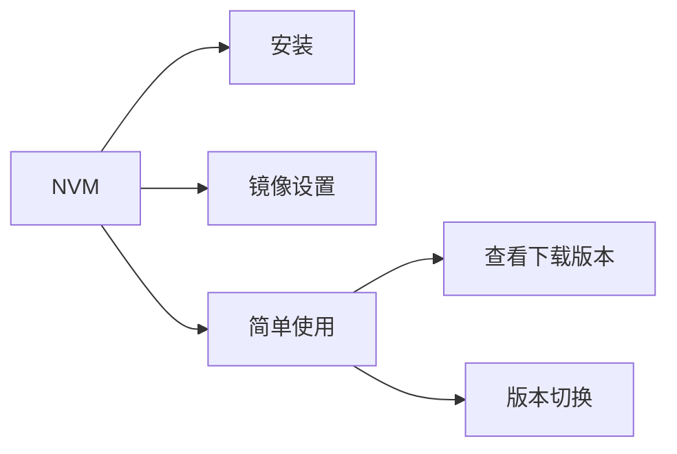

<!--more-->

# 一、安装

## 1.[下载安装包]([nvm文档手册 - nvm是一个nodejs版本管理工具 - nvm中文网 (uihtm.com)](https://nvm.uihtm.com/))

​	在官网上针对您的系统进行相应的下载。下载完之后安装，都是傻瓜式的操作，这不多赘述。

如果您有幸生活在“墙国”，需要配置淘宝镜像，才能正常使用该利器。


## 2.nvm淘宝镜像设置

使用命令，查看配置文件所在目录

```bash
nvm root
```

如果不出意外，应该会显示nvm的安装目录

```bash
Current Root: C:\Users\winford\AppData\Roaming\nvm
```

copy一下，cd 进入

```bash
Mode                 LastWriteTime         Length Name
----                 -------------         ------ ----
d-----         2023/4/20     21:11                v16.0.0
d-----         2023/4/20     21:03                v16.14.1
-a----         2015/9/30     14:09             86 elevate.cmd
-a----         2015/9/30     14:09            348 elevate.vbs
-a----         2015/9/30     14:09            491 install.cmd
-a----         2015/9/30     14:09          15086 nodejs.ico
-a----          2018/8/8      0:46        6150648 nvm.exe
-a----         2023/4/20     21:02            175 settings.txt
-a----         2023/4/20     20:57          14051 unins000.dat
-a----         2023/4/20     20:56         737272 unins000.exe
-a----         2023/4/20     20:57          11401 unins000.msg
```

大概是这样的目录结构

打开setting.txt

```bash
root: C:\Users\winford\AppData\Roaming\nvm
path: C:\Program Files\nodejs

node_mirror: https://npm.taobao.org/mirrors/node/
npm_mirror: https://npm.taobao.org/mirrors/npm/
```

加上下面两行代码就好了

# 二、使用

## 1.查看可下载的版本

```bash
PS C:\Users\winford\AppData\Roaming\nvm> nvm list available

|   CURRENT    |     LTS      |  OLD STABLE  | OLD UNSTABLE |
|--------------|--------------|--------------|--------------|
|    20.0.0    |   18.16.0    |   0.12.18    |   0.11.16    |
|    19.9.0    |   18.15.0    |   0.12.17    |   0.11.15    |
|    19.8.1    |   18.14.2    |   0.12.16    |   0.11.14    |
|    19.8.0    |   18.14.1    |   0.12.15    |   0.11.13    |
|    19.7.0    |   18.14.0    |   0.12.14    |   0.11.12    |
|    19.6.1    |   18.13.0    |   0.12.13    |   0.11.11    |
|    19.6.0    |   18.12.1    |   0.12.12    |   0.11.10    |
|    19.5.0    |   18.12.0    |   0.12.11    |    0.11.9    |
|    19.4.0    |   16.20.0    |   0.12.10    |    0.11.8    |
|    19.3.0    |   16.19.1    |    0.12.9    |    0.11.7    |
|    19.2.0    |   16.19.0    |    0.12.8    |    0.11.6    |
|    19.1.0    |   16.18.1    |    0.12.7    |    0.11.5    |
|    19.0.1    |   16.18.0    |    0.12.6    |    0.11.4    |
|    19.0.0    |   16.17.1    |    0.12.5    |    0.11.3    |
|   18.11.0    |   16.17.0    |    0.12.4    |    0.11.2    |
|   18.10.0    |   16.16.0    |    0.12.3    |    0.11.1    |
|    18.9.1    |   16.15.1    |    0.12.2    |    0.11.0    |
|    18.9.0    |   16.15.0    |    0.12.1    |    0.9.12    |
|    18.8.0    |   16.14.2    |    0.12.0    |    0.9.11    |
|    18.7.0    |   16.14.1    |   0.10.48    |    0.9.10    |

This is a partial list. For a complete list, visit https://nodejs.org/download/release
```

## 2.下载并安装特定版本

```
nvm install [版本号]
```

## 3.查看已下载的版本

```bash
PS C:\Users\winford\AppData\Roaming\nvm> nvm list

    16.14.1
  * 16.0.0 (Currently using 64-bit executable)
```

## 4.使用已安装的版本

```
nvm use [已安装的版本号] ---需要管理员权限
```

